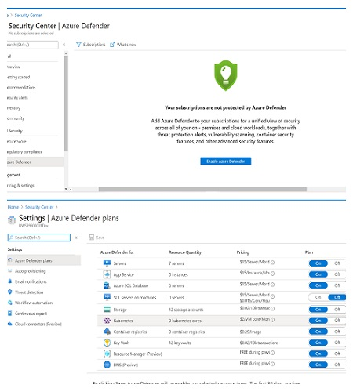
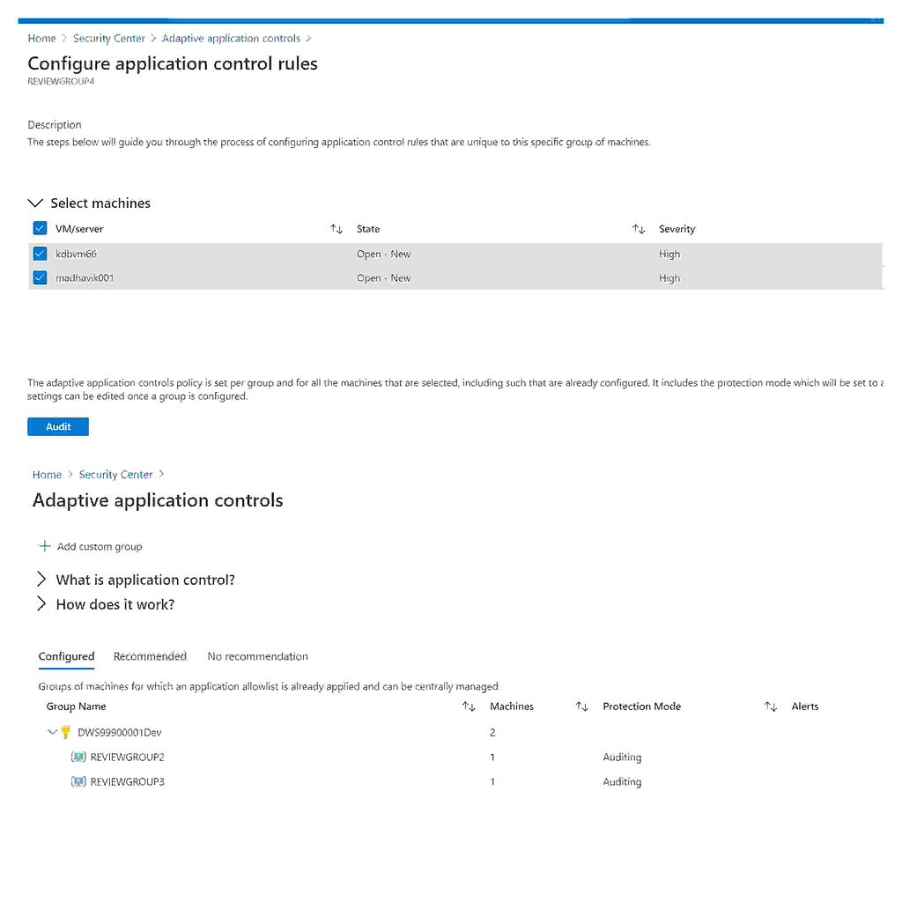
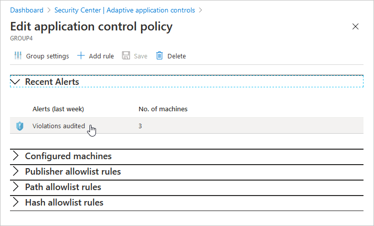

# Adaptive Application Controls
<span style="color:#2471A3;">#3125 Use Only Secured Applications</span>

<span style="color:#2471A3;">POC Documentation</span>

Adaptive application controls are an intelligent and automated solution for defining allow lists of known-safe applications for your machines.

<span style="color:#F4D03F;">Steps:</span>
  - [enable and configure](#Enable-and-Configure-Azure-Defender) adaptive application controls.
  - Security Center detects applications running in machines created and automatically segregates machines to configured/recommended/no recommendation in [Advanced Protection](#Advanced-Protection).
  - sends [security alerts](#security-alerts) if any application runs other than the ones you've defined as safe.
  
  ###### Enable and Configure Azure Defender 
 Adaptive application controls for defining safe applications should be enabled on your machines.
 
 
 
 To enable Azure Defender:
 ```
1. From Security Center's main menu, select Pricing & settings.
2. Select the subscription that you want to upgrade.
3. Select Azure Defender on to upgrade.
4. Select Save.
 ```
  ###### Advanced Protection
  Select the recommendation, or open the adaptive application controls page to view the list of suggested known-safe applications and groups of machines.
  >Select the required group and click ```Audit``` to configure.
  >
  >All the configurations in machines appear as rules.
  >
  >We can add custom rules by using ```+Add Rule```.
  
  
  The Adaptive application controls page opens with your VMs grouped into the following tabs:
  
  **configured**: Already have a defined allow list of applications
  
  **Recommended**: Machines that frequently run the same applications but are not yet configured.
  
  
  **No recommendation**:Machines without a defined allow list of applications, and which don't support the feature.


  ###### security alerts
  When any software installations other than known-safe applications happens in the machines violations are noted by Azure Defender,Which can be seen either at Recommendations or advanced protection area.
  
  
  ```
  1. select Adaptive application controls in Azure Defender Dashboard.
  2. review the Configured tab.
  3. select a group and investigate the alert.
  ```
  
  
